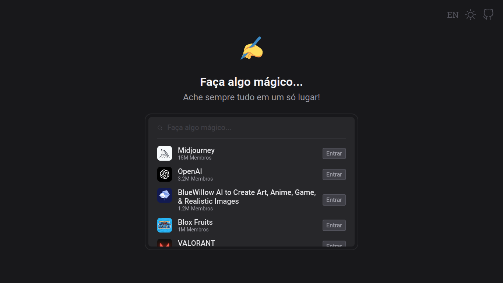

[previous]: ../../
[live]: https://dreisss.github.io/challenges-ballerini/monthly/2023/april

# [**_`Barra de Comandos`_**](#barra-de-comandos)

Projeto proposto na comunidade Ballerini do Discord. Um site para encontrar suas comunidades favoritas do Discord!

[**Live**][live] | [**Tecnologias**](#rocket-tecnologias) | [**Features**](#sparkles-features) | [**Layout**](#art-layout)

[][live]

## :rocket: **Tecnologias**

Esse projeto foi feito utilizando as seguintes tecnologias:

- HTML, CSS e JavaScript
- API do Discord
- Git e Github
- Figma

## :sparkles: **Features**

O projeto tem as seguintes features implementadas:

- Responsividade
- Conexão com API
- Temas claro e escuro
- Skeleton loader
- Navegação pelo teclado
- Atalhos de teclado
- Línguas Português e Inglês

## :art: **Layout**

Veja o layout do projeto no link do Figma: [:link:](https://www.figma.com/community/file/1225204988453832602)

[**_`❰ Retornar para página anterior`_**][previous]

